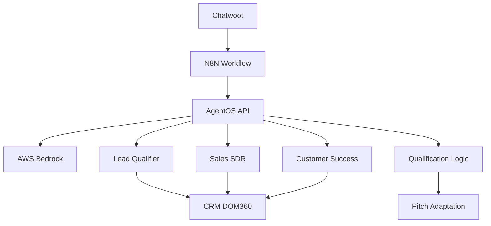

# MrDom SDR AgentOS + Bedrock

> Sistema de automação de vendas com agentes inteligentes usando AgentOS e AWS Bedrock

[](https://python.org)
[](https://fastapi.tiangolo.com)
[](https://github.com/agno-ai/agno)
[](https://aws.amazon.com/bedrock/)
[](LICENSE)

## 🎯 Visão Geral

O **MrDom SDR AgentOS** é um sistema avançado de automação de vendas que combina:

- **AgentOS**: Framework de agentes inteligentes especializados
- **AWS Bedrock**: Modelos de IA robustos e econômicos
- **N8N Integration**: Workflows automatizados
- **Chatwoot**: Plataforma de atendimento
- **Qualificação BANT**: Metodologia estruturada de vendas

## 🚀 Funcionalidades

### 🤖 Agentes Especializados
- **Lead Qualifier**: Qualificação BANT (Budget, Authority, Need, Timeline)
- **Sales SDR**: Agendamento de demos e conversão
- **Customer Success**: Suporte e resolução de problemas

### 🔄 Integração Completa
- **N8N Workflows**: Automação de processos
- **Chatwoot**: Atendimento omnichannel
- **CRM DOM360**: Gestão de leads
- **AWS Bedrock**: IA generativa

### 📊 Qualificação Inteligente
- Script específico MrDom SDR
- Análise de respostas automática
- Adaptação de pitch personalizada
- Coleta de dados estruturada

## 🏗️ Arquitetura



## 🛠️ Tecnologias

- **Backend**: Python 3.11+, FastAPI
- **IA**: AgentOS, AWS Bedrock (amazon.nova-lite-v1:0)
- **Automação**: N8N, Chatwoot
- **Banco**: PostgreSQL, Redis
- **Monitoramento**: Prometheus, Grafana

## 📦 Instalação

### Pré-requisitos
- Python 3.11+
- AWS Account (Bedrock access)
- Docker (opcional)

### Setup Rápido

```bash
# Clone o repositório
git clone https://github.com/DOM-360/mrdom-agentos-mcp.git
cd mrdom-agentos-mcp

# Instale dependências
pip install -r requirements.txt

# Configure ambiente
cp env.example .env
# Edite .env com suas credenciais

# Execute
python examples/bedrock_agentos_integration.py
```

### Configuração AWS Bedrock

```bash
# .env
AWS_ACCESS_KEY_ID=sua_chave_aws
AWS_SECRET_ACCESS_KEY=seu_secret_aws
AWS_DEFAULT_REGION=us-east-1
BEDROCK_MODEL=amazon.nova-lite-v1:0
```

## 🧪 Sandbox de Testes

### Sandbox Simples (Simulação)
```bash
python examples/conversation_sandbox.py
```

### Sandbox Avançado (API Real)
```bash
# Terminal 1: API
python examples/bedrock_agentos_integration.py

# Terminal 2: Sandbox
python examples/advanced_sandbox.py
```

### Sandbox de Qualificação MrDom
```bash
python examples/mrdom_qualification_sandbox.py
```

## 🔧 Uso

### API Endpoints

```bash
# Status dos agentes
GET /api/v1/agents/status

# Processar com melhor agente
POST /api/v1/agents/process-best
{
  "message": "Quero saber mais sobre os planos",
  "context": {"lead_exists": false}
}

# Sugerir agente
POST /api/v1/agents/suggest
{
  "message": "Preciso agendar uma demo"
}
```

### Integração N8N

Substitua o nó "Agente de IA1" por:

```json
{
  "type": "n8n-nodes-base.httpRequest",
  "parameters": {
    "method": "POST",
    "url": "http://localhost:8000/api/v1/agents/process-best",
    "jsonBody": "={\n  \"message\": \"{{ $json.content }}\",\n  \"context\": {\n    \"conversation_id\": \"{{ $json.conversation_id }}\",\n    \"lead_exists\": {{ $json.lead_exists }}\n  }\n}"
  }
}
```

## 📚 Documentação

- [Guia de Integração N8N](docs/n8n-agentos-integration.md)
- [Integração Bedrock](docs/bedrock-agentos-integration.md)
- [Sandbox de Testes](docs/sandbox-guide.md)
- [Guia Operacional](docs/operational-handover-guide.md)

## 🧪 Testes

```bash
# Teste completo
python scripts/test-bedrock-agentos.py

# Teste integração N8N
python scripts/test-n8n-agentos-integration.py

# Validação rápida
python scripts/quick-validation.py
```

## 📊 Monitoramento

- **Métricas**: Prometheus + Grafana
- **Logs**: Estruturados (JSON)
- **Health Checks**: `/health`, `/ready`
- **Performance**: Tempo de resposta < 5s

## 🤝 Contribuição

1. Fork o projeto
2. Crie uma branch (`git checkout -b feature/nova-funcionalidade`)
3. Commit suas mudanças (`git commit -am 'Adiciona nova funcionalidade'`)
4. Push para a branch (`git push origin feature/nova-funcionalidade`)
5. Abra um Pull Request

## 📄 Licença

Este projeto está licenciado sob a Licença MIT - veja o arquivo [LICENSE](LICENSE) para detalhes.

## 🏢 DOM-360

Desenvolvido pela [DOM-360](https://github.com/DOM-360) - Transformando operações comerciais em máquinas previsíveis de vendas.

---

**💡 Dica**: Comece com o sandbox de qualificação para entender o fluxo completo antes de integrar com produção.
